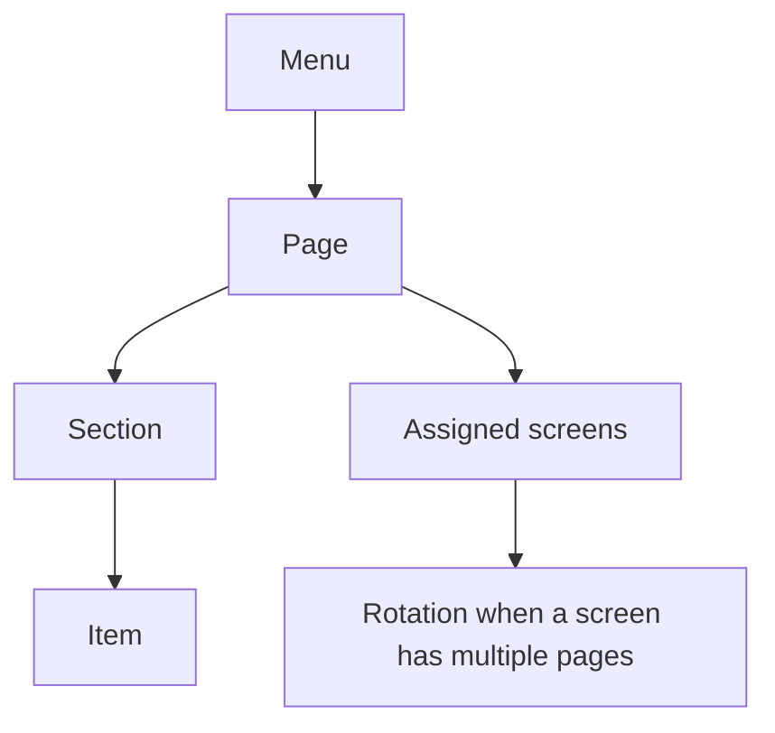

# Menu Builder V2 — approved workflow handoff

Status: **owner-reviewed design direction, 2026-08-11**

Slice 3-A refinement approved by the owner, 2026-08-12: the workspace now uses
the page/section breadcrumb and collapsible-panel behavior recorded in
`workflow-handoff.md` §13. This refinement supersedes the earlier selected-page
chip row without changing canvas rendering.

Live prototype: <https://vennue-menu-builder-m3.jmiedreich.chatgpt.site>

This folder is the current implementation handoff for the Menu Builder. It supplements the approved Menus bundle one directory above and **supersedes older M2 guidance only where this V2 package explicitly differs**.

## Read in this order

1. [`workflow-handoff.md`](workflow-handoff.md) — complete behavior, routes, and before/current/after paths.
2. [`page-examples.md`](page-examples.md) — reviewed screenshots and what each one establishes.
3. [`../decisions.md`](../decisions.md) — all existing Menus decisions that V2 does not explicitly replace.
4. [`../M2 Hi-Fi - Menu builder.dc.html`](../M2%20Hi-Fi%20-%20Menu%20builder.dc.html) — visual foundation only; use V2 for changed structure and navigation.

## V2 decisions that replace older M2 assumptions

- A menu explicitly contains **pages**, pages contain **sections**, and sections contain **items**.
- The horizontal **Menu pages** rail is the only place for page navigation and page management.
- The left rail shows **sections only for the selected page**.
- Pages—not sections—are assigned to screens.
- A page can be viewed as the **entire page** or as one focused section.
- In focused-section view, the page name is the breadcrumb action back to the
  entire page; sections are not repeated as a second horizontal chip row.
- The Sections/History and Item panels collapse independently and remember the
  browser preference.
- New menus open on the reusable **Import content** landing page before the blank builder.
- Existing menus can reopen Import content from menu-level actions.
- Page and section renaming occurs inline where the name appears.
- Page capacity is evaluated per assigned screen; overflow is never silently clipped.

## Content hierarchy

## Implementation rule

The screenshots are design references, not production code. Recreate the behavior in `src/back-office/` using existing components, `sky-ui-tokens.css`, and the real render engine. Where a screenshot captures an intermediate design iteration, `page-examples.md` says which part remains authoritative.

## Scope boundary

This handoff defines intended behavior. Some controls in the prototype are demonstrative and are not persisted. The implementation agent must not infer that a visible click alone means the backend behavior exists.
