# Menu Builder V2 — visual page examples

These images come from the owner review session that produced V2. They include the final direction and earlier iterations that explain rejected patterns. Use the notes below to distinguish them.

## Current direction

### Page-first workspace and item editing

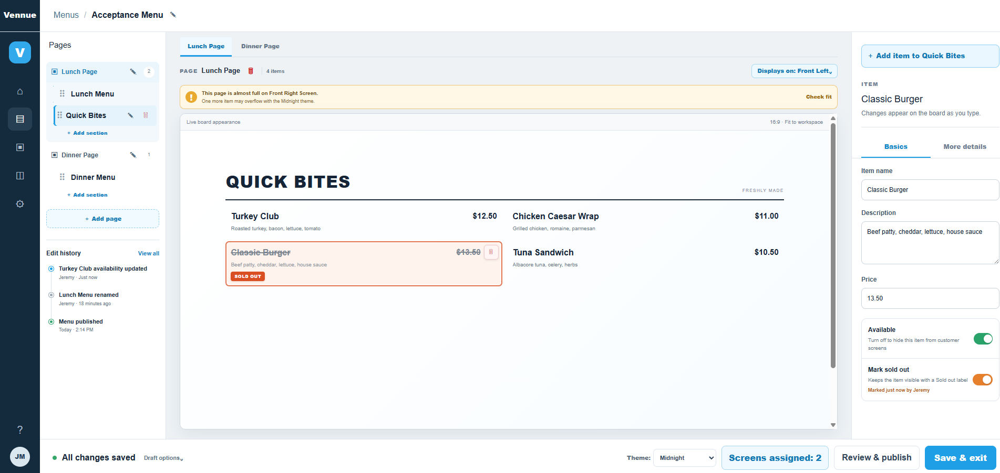

Use this for the overall three-column workspace, page tabs, page-to-screen assignment, capacity warning, live board, inspector, and footer. **V2 correction:** the left rail no longer repeats pages; it shows sections only for the selected horizontal page tab.

### Import content landing

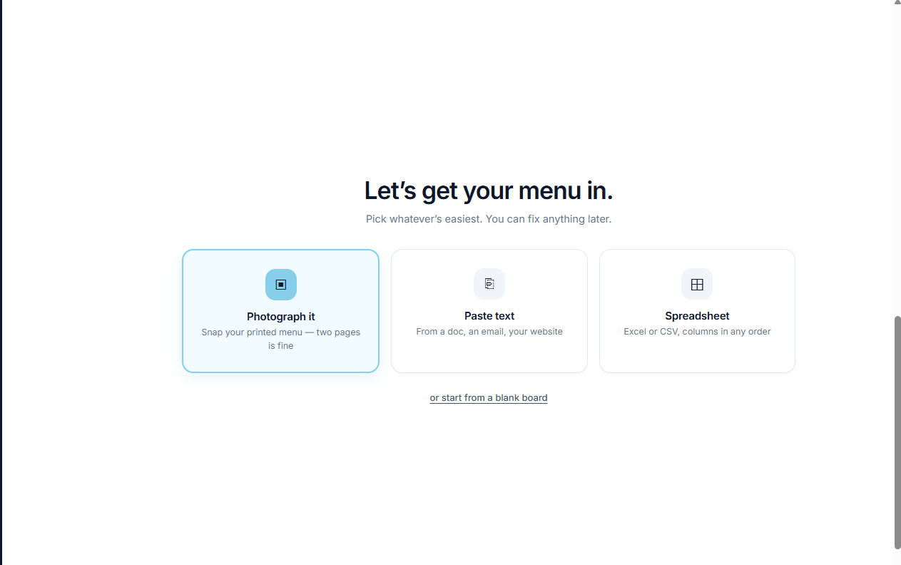

This is the first destination after Create menu and is reusable from existing-menu actions.

### Sections-only left rail

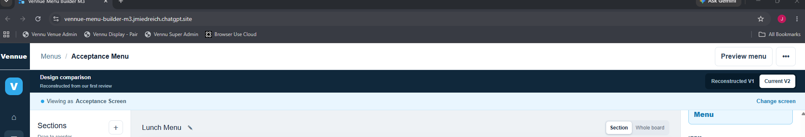

This establishes the final responsibility split: pages are horizontal; the left rail manages only the selected page’s sections.

### Horizontal page rail and selected-page header

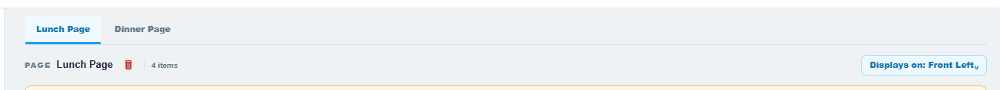

Tabs are the page navigator. The selected-page header carries scope, count, assignment, and page actions. Tabs scroll horizontally when necessary.

## Supporting interaction examples

### Entire-page versus focused-section viewing

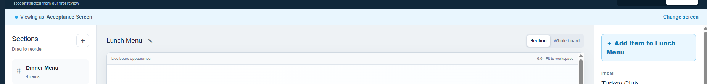

The final control is Entire page plus the actual section names. Older Section/Whole board wording shown in the capture is superseded, but the need for an explicit scope control remains authoritative.

### Inline name and item controls

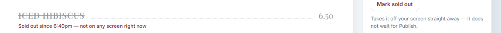

This compact page-header example establishes where page identity and actions live. Page and section names edit where they appear; do not send the user to a separate rename field or dialog.

### Screen preview selector

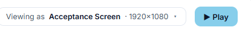

This selector previews geometry only. Assignment belongs to the selected-page assignment control.

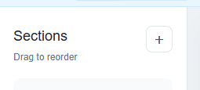

This second crop is retained because it shows the same control at its compact size. It is not a second assignment surface.

## Design evolution — do not recreate literally

The following examples are retained because they record alternatives considered during review.

### Rejected: pages duplicated in the left rail

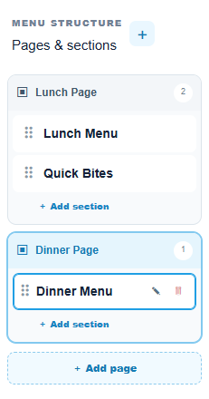

This iteration proved the hierarchy but duplicated the horizontal tabs. V2 keeps the horizontal page rail and reverts the left rail to sections only.

### Rejected: page selector on each section row

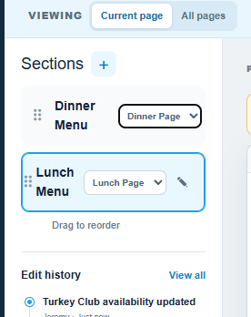

This became crowded and made page placement feel like a per-row form. Creating a section inside the selected page now establishes placement.

### Earlier full-board visual foundation

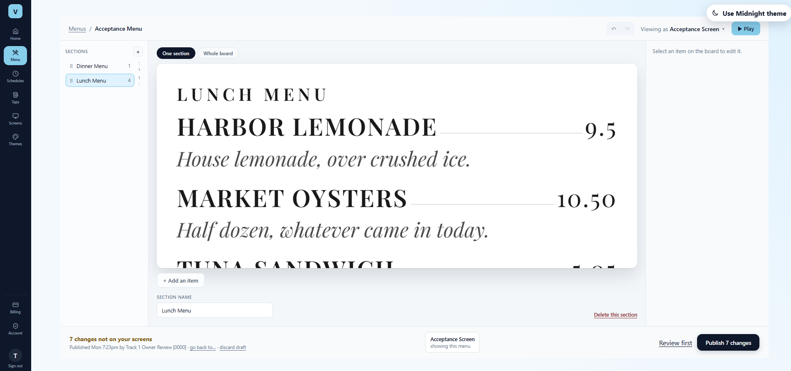

Use its Sky UI styling and board rendering as visual context only. Apply the V2 navigation and workflow rules from this folder.

## Source of truth rule

When an image and `workflow-handoff.md` differ, the workflow handoff wins. When this V2 folder does not address an older Menus decision, `../decisions.md` wins.
