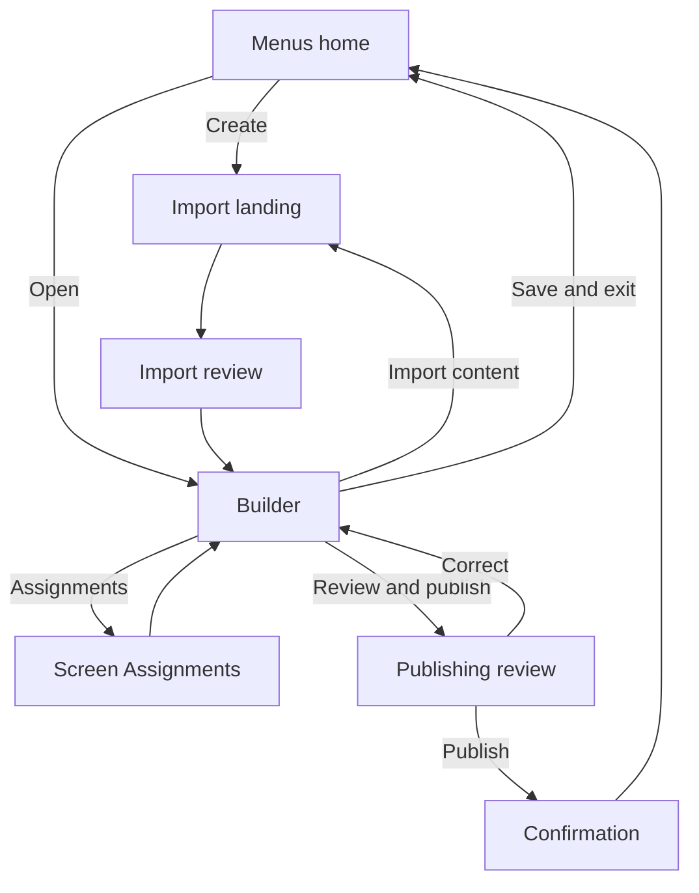

# Menu Builder V2 — complete workflow and route map

## 1. Entry paths

| Function | Previous location/state | Current destination/state | After path |
|---|---|---|---|
| Create menu | Menus home | Import content landing | Import review, then Builder |
| Open existing menu | Menus home/menu card | Builder with last draft state | Edit, import, assign, publish, or save and exit |
| Reopen import | Existing menu in Builder | Menu actions → Import content | Add/replace decision → Import review → Builder |

### Import landing

The choices are Photograph it, Paste text, Spreadsheet, and Start blank. Photo, text, and spreadsheet imports converge on one review step that proposes pages, sections, items, descriptions, and prices. Only uncertain results need correction.

For an existing menu, the user must explicitly choose whether the import adds draft content or replaces existing content. Replacement requires confirmation and preserves the current theme plus immediate availability/sold-out facts unless a later product decision changes that rule.

## 2. Global and menu-level controls

| Function | Previous | Current action | After |
|---|---|---|---|
| Menus breadcrumb | Builder | Select Menus | Menus home |
| Menu name | Builder breadcrumb/title | Select pencil; edit inline | Same Builder with updated menu name |
| Menu actions | Builder | Open `…` | Import content, Duplicate menu, and other approved menu actions |
| Help | Any Builder state | Select Help | Contextual help drawer/center |
| Account | Any Builder state | Select avatar | Account menu |

Menu-level actions must not be confused with selected-page actions.

## 3. Menu pages rail

The horizontal Menu pages rail is the sole page navigator and page-management surface.

| Function | Previous | Current action | After |
|---|---|---|---|
| Select page | Another page active | Select page tab | Loads that page, its sections, assignments, count, and preview |
| Add page | Any existing page | Select `+` / Add page | Creates a blank page, selects it, and begins inline naming |
| Rename page | Page active | Page actions → Rename | Page tab/title becomes an inline field; save on Enter/blur |
| Delete page | Page active | Page actions → Delete | Confirmation; move or delete contained sections; remove assignments |
| Reorder pages | Multiple pages | Drag page tab | Updates order and any screen rotation sequence using that order |
| Many pages | Tabs exceed width | Horizontal scroll | Additional tabs remain reachable; tabs never wrap |

Rules:

- A menu always retains at least one page.
- Tabs show page names only. Counts, assignments, and destructive actions stay in the selected-page header.
- The page tab identifies which page is active; it does not also mean “entire page view.”

## 4. Left rail: sections only

The left rail is scoped to the selected page and is not another page navigator.

| Function | Previous | Current action | After |
|---|---|---|---|
| Select section | Page selected | Select section | Viewing changes to that section; item editing focuses there |
| Add section | Page selected | Select Add section | New section is created inside that page and enters inline naming |
| Rename section | Section selected | Select pencil | Section name edits inline in the left rail |
| Reorder section | Two or more sections | Drag handle | Section order changes within the current page |
| Delete section | Section selected | Select trash/action | Confirm; remove section and its items; select a valid remaining scope |
| Switch page | A section list is shown | Select another page tab | Left rail refreshes to that page’s sections |

Use indentation, spacing, and one selected accent. Do not draw borders around every page, section, and selected region.

## 5. Selected-page workspace header

The page header has three jobs: identify the page, choose viewing scope, and assign screens.

### Page identity

Show the page name and the live total of items across all sections on that page. Page actions live in an `…` menu rather than displaying a permanent red delete icon.

### Viewing scope

Options are Entire page plus every section belonging to the selected page.

| Function | Previous | Current action | After |
|---|---|---|---|
| View entire page | A section focused | Viewing → Entire page | Canvas renders all sections on the page together |
| Focus a section | Entire page/other section | Choose section in Viewing or left rail | Canvas focuses the actual selected section |

The three navigation meanings are distinct:

- Page tabs: which page am I working on?
- Sections rail: which section am I editing?
- Viewing: am I seeing the complete page or one focused section?

Every Viewing option must carry the real section identifier, not a shared placeholder value.

## 6. Page-to-screen assignment

Pages—not sections—are assigned to screens.

| Function | Previous | Current action | After |
|---|---|---|---|
| Quick assign | Page selected | Open assignment pill | Multi-select screens; add/remove selected page |
| Existing page on screen | Screen selected already has a page | Add this page | Explain rotation; preserve existing page; offer rotation management |
| Full management | Assignment pill open/footer overview | Manage all pages and screens | Screen Assignments view |
| Save assignments | Screen Assignments | Save and return | Builder with assignment draft retained |
| Cancel assignments | Screen Assignments | Cancel | Builder with pre-entry assignment state restored |

The full Screen Assignments view shows screen name, location, geometry/resolution, online state, assigned pages, page order, and rotation settings. Assignment changes remain draft changes until Review & Publish.

If a selected page is assigned to multiple screen geometries, show a secondary Preview as Screen control. Preview never changes assignments.

## 7. Canvas and capacity

The canvas is the live board preview. It must use the real renderer and selected theme.

| Function | Previous | Current action | After |
|---|---|---|---|
| Select item | Page/section preview | Select item | Right inspector loads that item |
| Delete item | Item selected | Select delete | Confirm; remove item; choose next valid focus |
| Reorder item | Section preview | Drag item | Item order changes in that section |
| Check fit | Capacity warning | Select Check fit | Results by assigned screen with affected content and corrections |

Capacity states are Fits, Nearly full, and Overflowing. Capacity is calculated using content, theme, screen geometry/orientation, layout rules, and the assigned target. Unresolved overflow must be called out during publishing and must never be silently clipped.

## 8. Item inspector

| Function | Previous | Current action | After |
|---|---|---|---|
| Add item | Section selected | Add item to Section | Create/select item; open inspector |
| Edit name/description/price | Item selected | Type in Basics | Canvas updates immediately; draft autosaves |
| Available off | Item available | Toggle Available off | Hide item from customer screens; clear sold-out state |
| Mark sold out | Item selected | Toggle sold out on | Keep visible using theme-defined sold-out styling; ensure Available is on |
| More details | Item selected | Select More details | Image, dietary/allergen, modifier, schedule, and nutrition paths as supported |

Availability/sold-out timing must follow the authoritative Menus decisions. The builder stores state; the theme determines the customer-facing sold-out appearance.

## 9. Theme, history, drafts, and footer

| Function | Previous | Current action | After |
|---|---|---|---|
| Change theme | Builder | Select theme | Real canvas rerender and new fit evaluation |
| Edit history | Builder | View all | Full attributable menu history |
| Discard draft | Draft differs from published | Draft options → Discard | Confirm; restore published state |
| Go back to published version | Draft exists | Restore/go back action | Published state becomes the working draft, then requires publish |
| Screens assigned | Builder footer | Select count | Full Screen Assignments view |
| Review & publish | Draft changes exist | Select Review & publish | Publishing review |
| Save & exit | Builder | Select Save & exit | Save draft and return to Menus home; do not publish |

## 10. Publishing review

Review shows every page, page sections, assigned screens, rotation/order, theme, availability/sold-out changes, capacity results, and content additions/changes/removals. From review the user can publish now, schedule if supported, or return to Builder. Physical screens change only after the explicit publish action.

## 11. Route map

## 12. Required implementation corrections versus the prototype

1. Persist page, section, item, assignment, and theme state.
2. Make imported content pass through review before it alters the Builder.
3. Implement real page action menus, inline page/section naming, tab scrolling, and ordering.
4. Make Viewing identify the exact section and render Entire page correctly.
5. Make item edits and Add item update real state and the real renderer.
6. Make Screen Assignment Cancel actually restore the prior assignment snapshot.
7. Calculate counts and capacity from real data for each assigned screen.
8. Replace hard-coded sold-out presentation with theme-defined presentation.
9. Wire Review & Publish, Save & Exit, breadcrumbs, history, help, and account paths.
10. Ship browser assertions with the surface, covering variations and state transitions rather than only the happy path.
