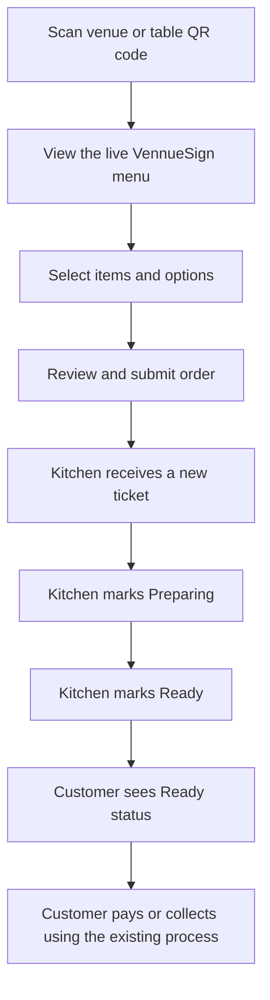
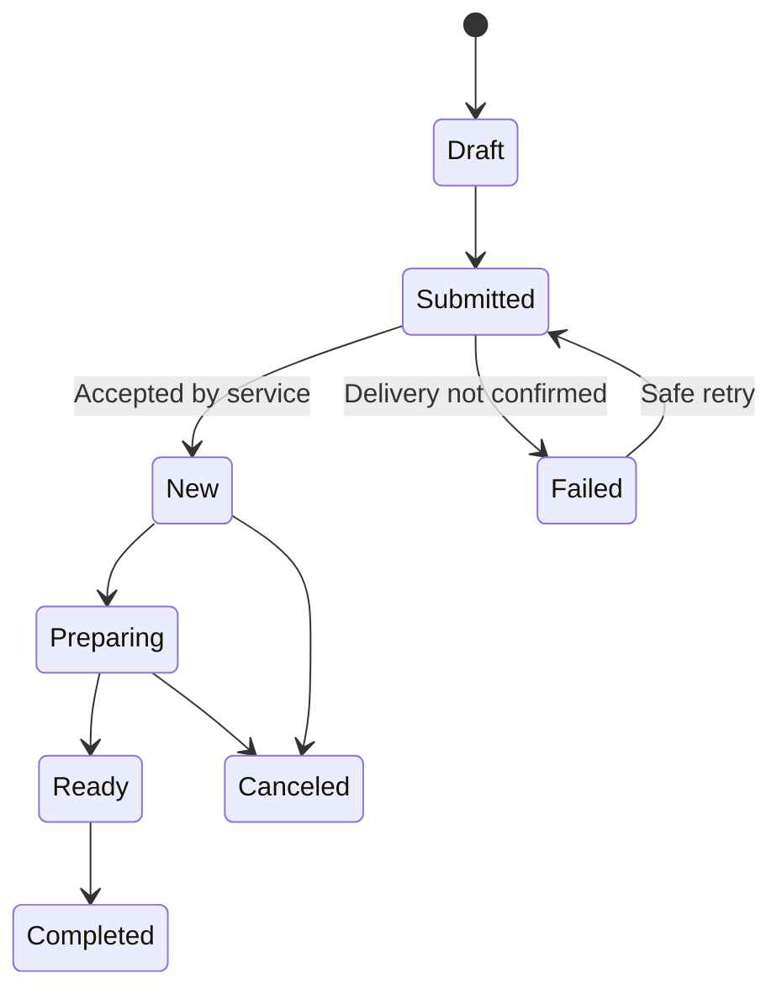

# QR Ordering and Lightweight Kitchen Display Concept

**Audience:** product owner, UX designers, architects, and future implementation agents  
**Status:** Proposed product concept; not approved, scheduled, priced, or committed for implementation  
**Created:** 2026-08-20  
**Working names:** VennueSign Quick Order, Vennue Kitchen

## Purpose

This document records a possible VennueSign feature for very small restaurants that still use a traditional cash register and do not have a modern point-of-sale system.

The concept adds a lightweight, browser-based ordering and kitchen workflow to the menu data and screen platform VennueSign already provides. It is intentionally smaller than a POS: the restaurant keeps its existing register and payment process while VennueSign handles order capture, kitchen visibility, and order status.

## Concept in one sentence

> Turn the menu a restaurant already manages and displays in VennueSign into a QR ordering experience and a real-time kitchen order screen—without requiring the restaurant to replace its cash register or buy a full POS.

## Customer problem

Some small restaurants have:

- A basic cash register that works adequately for taking payment.
- Paper menus or static menu boards that are difficult to keep synchronized.
- Orders communicated verbally or with handwritten tickets.
- No kitchen display, order timers, or ready-order status.
- Neither the budget nor the operational appetite for a complete POS replacement.

They may want a few modern tools without adopting payroll, inventory, accounting, cash-drawer management, receipt processing, or a large restaurant-management platform.

## Product opportunity

VennueSign already owns the menu and screen relationship. The same source menu could drive:

- Public digital menu boards.
- A mobile web menu opened from a QR code.
- Order submission.
- Kitchen preparation screens.
- A customer-facing order-ready screen.

A restaurant changes an item, price, availability, or sold-out state once and the change is reflected across each supported surface.

This reverses the direction taken by many competitors. Most begin with a POS or online-ordering platform and later add display screens. VennueSign would begin with the displayed menu and add only the operational path the restaurant needs.

## Product principles

1. **Not a POS.** The first version does not replace the cash register or become the merchant's financial system of record.
2. **One menu, not a second catalog.** Ordering must use the existing VennueSign menu and item identity rather than requiring duplicate menu maintenance.
3. **No customer application install.** Customers order from a lightweight mobile web experience opened by scanning a QR code.
4. **Fast kitchen visibility.** A successfully submitted order appears on the correct kitchen screen within seconds.
5. **Truthful operating state.** Ordering must pause visibly when orders cannot be delivered reliably to the restaurant.
6. **Low training requirement.** A small restaurant should be able to learn the kitchen workflow during one short setup session.
7. **Payment remains separate initially.** The proposed MVP assumes payment at the restaurant's existing register.
8. **Operational display data only.** The MVP should collect the minimum customer information needed to fulfill the order and must never receive card data.

## Proposed customer flow

The QR code may identify a venue, service point, pickup counter, or table. The exact service models remain an owner decision.

## Proposed surfaces

| Surface | Primary user | Purpose |
| --- | --- | --- |
| QR ordering web app | Customer | Browse the current menu, choose items and options, submit an order, and view its status |
| Kitchen display | Kitchen staff | See new orders, elapsed time, item details and notes; advance orders through preparation |
| Order-ready display | Customers or counter staff | Show pickup numbers or names that are ready |
| Lightweight order controls | Venue staff | Pause ordering, set service status, cancel an order, and handle exceptions |
| Existing Menu Builder | Venue owner/editor | Continue to manage the shared menu, prices, availability, and sold-out state |

The kitchen display and order-ready display should be treated as VennueSign screen purposes, not separate unrelated products.

## Proposed MVP

### Included

- Venue-generated QR code.
- Mobile browser ordering with no sign-in and no application download.
- A VennueSign menu selected as the source.
- Item selection and quantity.
- Required and optional modifier choices where the item supports them.
- Short order notes with safe length limits.
- Pickup name, order number, or table number.
- Final review before submission.
- Idempotent submission so a double tap does not create duplicate orders.
- Immediate kitchen notification.
- Kitchen ticket cards with elapsed time.
- Order states: New, Preparing, Ready, Completed, and Canceled.
- Customer status page that can be reopened on the same device.
- Ordering pause/resume.
- Sold-out and unavailable items removed or disabled before submission.
- Clear handling when an item changes between selection and submission.
- Basic daily order history for restaurant operations and support.
- Tenant, venue, role, and screen scoping consistent with VennueSign.

### Deliberately excluded from the first version

- Card or digital-wallet payment.
- Cash-drawer operation.
- Tax filing or fiscal receipt production.
- Accounting or general-ledger integration.
- Payroll, labor scheduling, or time clocks.
- Ingredient inventory and recipe depletion.
- Delivery-driver dispatch.
- Marketplace ordering.
- Loyalty and customer marketing.
- Refunds and chargebacks.
- Full POS replacement claims.

These exclusions define the product's value proposition rather than representing missing POS features.

## Order lifecycle

Important behavior:

- The customer must not see a successful submission until the service has durably accepted the order.
- Repeated submission with the same idempotency key returns the original order rather than creating another.
- Kitchen staff can see how long each active order has waited.
- Canceling after preparation starts requires an explicit confirmation and remains in the order history.
- Completed and canceled orders leave the active kitchen queue but remain available for a bounded period.

## Relationship to existing VennueSign capabilities

The concept should reuse established VennueSign foundations wherever they are authoritative:

- Customer, tenant, venue, authorization, and audit boundaries.
- The existing menu and item model.
- Menu availability and sold-out behavior.
- Menu Builder as the content-management surface.
- Screen registration, assignment, health, and player delivery.
- Real-time communication already used for screen updates.
- Shared rendering only where the ordering or kitchen experience benefits from it.

The ordering experience should not query Theme Studio drafts. It should consume a saved menu and an appropriate immutable theme/version contract, consistent with the existing separation between theme authoring, Menu Builder, and playback.

## Minimum new product concepts

The MVP likely requires several concepts that are not part of display publishing:

| Concept | Minimum responsibility |
| --- | --- |
| Ordering profile | Connects a venue, menu, service mode, QR code, operating hours, and ordering status |
| Order | Durable submission identity, venue, source QR/service point, status, timestamps, and customer-facing reference |
| Order line snapshot | Preserves the ordered name, price, quantity, and selections even if the menu changes later |
| Modifier group | Defines required/optional choices and selection limits for an orderable item |
| Kitchen route | Determines which kitchen screen or station receives an item or order |
| Order event | Auditable status transition such as submitted, preparing, ready, canceled, or completed |

Menu objects remain the source of current public content. An accepted order stores a snapshot so later menu edits do not rewrite the historical ticket.

## Failure and recovery expectations

- If VennueSign cannot durably accept orders, the customer sees ordering as temporarily unavailable before checkout.
- If the customer loses connection after submitting, reopening the status link should recover the accepted order.
- If a kitchen screen disconnects, venue staff receive a visible warning and the system follows an explicit ordering-pause policy.
- A newly reconnected kitchen screen reloads the authoritative active queue rather than relying only on missed real-time events.
- Invalid or stale item selections are revalidated at submission and returned to review without losing the rest of the order.
- The last valid menu may remain visible, but visibility alone must never imply that ordering is available.
- The system must distinguish an unsubmitted draft, a safely accepted order, a failed submission, and a customer retry.

## Security and privacy boundaries

- QR codes identify a public ordering context; they do not grant administrative access.
- Administrative and kitchen actions require authenticated, venue-scoped authorization.
- Public order status uses an unguessable token and reveals only the minimum fulfillment information.
- Order notes are treated as untrusted input and safely encoded everywhere.
- Rate limits, bot protection, bounded quantities, and duplicate-submission protection are required.
- Customer name or phone number is collected only when the selected service model needs it.
- Retention for customer identifiers and order history must be explicitly decided.
- The MVP never accepts or stores payment-card data.

## Competitive validation

The category already exists, validating customer demand:

| Product | Relevant capability | Difference from the proposed VennueSign position |
| --- | --- | --- |
| [RestApp](https://www.restapp.com/online-ordering-types/self-ordering/) | QR self-ordering, customer ready notification, device-based order management, and kitchen display | Broader online-ordering suite; one of the closest functional comparisons |
| [GloriaFood](https://www.gloriafood.com/qr-code-ordering-system-restaurant-menu) | Dine-in QR ordering and restaurant order acceptance | Primarily an online-ordering platform rather than a screen-first product |
| [Tabski](https://tabski.com/contactless-ordering/) | Web ordering, location-aware QR codes, tabs, payments, and station routing | More service and payment functionality than the proposed MVP |
| [abcPOS](https://www.abcpos.com/qr-code-ordering-system) | QR ordering connected to kitchen operations | Sold as part of a POS ecosystem |
| [Toast KDS](https://doc.toasttab.com/doc/platformguide/platformKDSOverview.html) | Mature kitchen display and real-time front/back-of-house communication | Requires the much larger Toast POS ecosystem |

The concept is not unique by feature checklist. Its possible differentiation is the combination of:

- The menu already exists in VennueSign.
- The same availability state drives boards and ordering.
- The restaurant can keep its current register.
- Kitchen and order-ready views fit the existing VennueSign screen platform.
- Setup and pricing can remain substantially lighter than a full POS deployment.

## Initial positioning

A possible product message is:

> Keep your cash register. Add mobile ordering and a kitchen screen.

The feature should not be marketed as a cheaper POS. It is a small operational upgrade for restaurants that do not want a POS replacement.

## MVP success criteria

A first release would demonstrate value if:

- A restaurant can enable ordering without rebuilding its menu.
- A customer can reach the menu from a QR scan and submit without creating an account.
- A valid order appears on the correct kitchen display within seconds.
- Double submission does not create duplicate tickets.
- Kitchen staff can process the full queue with minimal training.
- Sold-out changes are reflected on menu boards and ordering surfaces from one action.
- A service interruption cannot silently accept orders that the kitchen will not see.
- The restaurant can continue taking payment through its existing process.

## Decisions still required

1. Is payment at the existing register a binding MVP boundary?
2. Is the first service mode counter pickup, table service, or both?
3. Does the restaurant accept each order manually, or does durable submission place it directly in New?
4. Which customer identifier is required: order number, pickup name, table number, phone number, or a configurable choice?
5. Are modifiers part of the first release, and how complex may their rules become?
6. Does one order route to one kitchen screen initially, or may items route to multiple stations?
7. What happens automatically when every assigned kitchen screen is offline?
8. Is a customer-facing ready-order screen part of the first release or a later extension?
9. How long are completed orders and customer identifiers retained?
10. What reporting is operationally necessary without drifting into POS/accounting scope?
11. Should staff be able to enter counter or phone orders through the same lightweight web application?
12. How is this packaged and priced relative to VennueSign screens?

## Status and next design step

This is an exploratory concept only. It does not authorize implementation or change the approved Menus design authority.

If the owner chooses to continue, the next design step is a bounded workflow prototype covering:

1. QR scan and ordering.
2. Submission confirmation and failure recovery.
3. Kitchen queue and status changes.
4. Customer ready status.
5. Ordering pause when the kitchen cannot receive orders.
