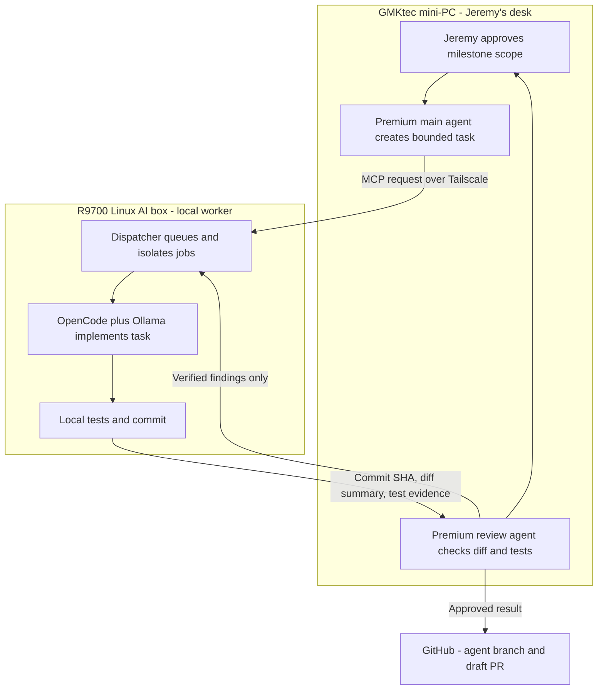
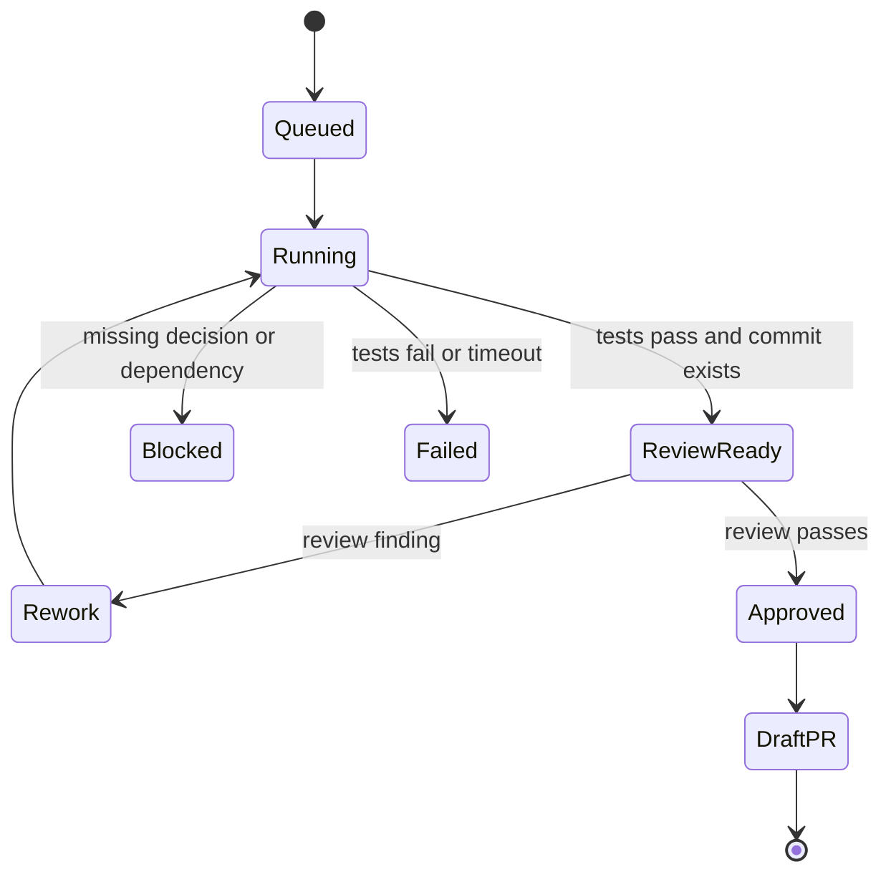

# Local AI Development Box

Status: approved planning record; hardware not yet assembled

Last verified: 2026-08-22

## Purpose

This document defines the dedicated Linux machine that will perform bounded Vennusign coding jobs with open-source models. Jeremy continues working on the GMKtec mini-PC. A premium ChatGPT, Codex, or Claude agent on that machine owns planning and review; the Linux AI box performs delegated implementation work.

The intended outcome is more development performed locally without allowing a local model to choose product scope, merge code, or gain unrestricted access to Vennusign infrastructure.

## Decisions

- Build one Linux workstation around one AMD Radeon AI PRO R9700 32GB.
- Use a supported Ubuntu 24.04 point release. As of this verification, AMD lists Ubuntu 24.04.3 for the R9700 in the current ROCm support matrix.
- Use 64GB of system RAM as a matched two-DIMM kit.
- Start with at most two active implementation jobs; queue additional work.
- Keep milestone planning, product decisions, independent review, and merge approval on the GMKtec mini-PC with premium agents.
- Reach the AI box through Tailscale. Do not expose SSH, Ollama, OpenCode, or the dispatcher directly to the public internet.
- Give every job its own Git worktree and branch.
- Require tests and a commit before a job can report completion.
- Require premium-agent review before a branch can be proposed for merge.
- Never auto-merge locally generated work.
- Treat a second R9700 as a future workstation redesign, not an add-on to this B650 build.

## Final single-GPU hardware configuration

| Role | Selected component | Reason |
|---|---|---|
| GPU | ASRock Radeon AI PRO R9700 Creator 32GB | 32GB VRAM, ROCm support, two-slot blower design, four DisplayPort outputs |
| CPU | AMD Ryzen 7 9700X | Eight Zen 5 cores, 65W default TDP, basic integrated graphics for troubleshooting |
| Motherboard | Gigabyte B650 AORUS Elite AX Ice | AM5, 2.5GbE, Wi-Fi 6E, three M.2 slots, Q-Flash Plus, reinforced primary GPU slot |
| Memory | 64GB (2x32GB) DDR5-6000 CL30 AMD EXPO kit | Enough host memory for model loading, builds, tests, worktrees, and two bounded workers |
| CPU cooler | Thermalright Phantom Spirit 120 SE | Strong air cooling without the additional failure modes of a liquid loop |
| Storage | Lexar NM790 2TB NVMe SSD | Fast local repositories, models, caches, builds, and worktrees |
| Power supply | be quiet! Pure Power 13 M 1000W, ATX 3.1 | Native 12V-2x6 cable and appropriate single-GPU headroom |
| Case | Montech AIR 903 MAX | High airflow, four included 140mm fans, 400mm GPU clearance |
| Operating system | Ubuntu 24.04.3 | Current supported Ubuntu target for the R9700 and ROCm; recheck before installation |
| Remote access | Tailscale plus SSH | Private authenticated network with no router port forwarding |

Do not mix two separate RAM kits. Install the matched modules in A2 and B2. If a Micro Center processor bundle includes only 32GB, use it for initial setup only or replace it with the final matched 64GB kit; do not add a second unrelated kit.

### Physical and power compatibility

- The ASRock card is 271 x 112 x 39mm, occupies two slots, weighs 1,069g, and uses one 12V-2x6 connector.
- ASRock asks for 30mm of additional length for the power-cable bend.
- The AIR 903 MAX accepts a GPU up to 400mm long and a CPU cooler up to 180mm tall.
- The R9700 has a 300W typical board power rating. AMD and ASRock specify a 750W minimum PSU; the selected 1000W unit adds comfortable workstation headroom.
- Use the power supply's native 12V-2x6 cable. Do not use a modular cable from another power supply.
- The selected B650 motherboard is a single-GPU design for this purpose. Two R9700 cards would require a motherboard/platform with two suitably spaced CPU-connected PCIe slots, additional lanes, a larger PSU, and a new thermal plan.

References:

- [ASRock R9700 Creator specifications](https://www.asrock.com/Graphics-Card/AMD/Radeon%20AI%20PRO%20R9700%20Creator%2032GB/)
- [AMD Radeon AI PRO R9700 specifications](https://www.amd.com/en/products/graphics/workstations/radeon-ai-pro/ai-9000-series/amd-radeon-ai-pro-r9700.html)
- [AMD Ryzen 7 9700X specifications](https://www.amd.com/en/products/processors/desktops/ryzen/9000-series/amd-ryzen-7-9700x.html)
- [Gigabyte B650 AORUS Elite AX Ice](https://www.gigabyte.com/us/Motherboard/B650-AORUS-ELITE-AX-ICE)
- [Montech AIR 903 MAX specifications](https://www.montechpc.com/air-903-max)
- [AMD ROCm compatibility matrix](https://rocm.docs.amd.com/en/docs-7.1.1/compatibility/compatibility-matrix.html)

## Monitor connection

The ASRock R9700 Creator has four full-size DisplayPort 2.1a outputs and no HDMI connector.

- If the monitor has DisplayPort, use a full-size DisplayPort-to-DisplayPort cable. DisplayPort 1.4 is sufficient for an ordinary setup monitor and is backward-compatible with the card.
- If the monitor has HDMI only, use an active DisplayPort-source-to-HDMI-display adapter rated for the monitor's resolution and refresh rate. The recommended Micro Center adapter supports up to 4K at 60Hz.
- Connect the normal monitor to the R9700 so the actual GPU display path is exercised.
- The motherboard also has HDMI and DisplayPort. The Ryzen 7 9700X has basic integrated Radeon graphics, so the motherboard outputs are a useful BIOS and driver troubleshooting fallback.

## Micro Center build extras

The inventory below was observed on 2026-08-22 at the Madison Heights store selected by `storeid=055`, the nearest Micro Center to ZIP 48823:

Micro Center, 32800 Concord Drive, Madison Heights, Michigan 48071.

Prices and inventory change. Reserve scarce items before making the drive.

### Buy for the build

| Item | Micro Center product | SKU | Observed price | Observed Madison Heights stock | Why |
|---|---|---:|---:|---:|---|
| Manual Phillips #2 screwdriver | [Eclipse #2 x 6-inch Phillips screwdriver](https://www.microcenter.com/product/466864/eclipse-enterprise-rubber-grip-phillips-screwdriver-2-x-6?storeid=055) | 96776 | $7.99 | 3 | Primary case, motherboard, PSU, cooler, and GPU tool |
| ESD wrist strap | [Kingwin anti-static wrist strap](https://www.microcenter.com/product/336438/kingwin-anti-static-wrist-strap?storeid=055) | 740001 | $4.99 | 1 | Reduces electrostatic-discharge risk |
| GPU support | [Micro Connectors adjustable GPU support brace, two-pack](https://www.microcenter.com/product/680114/micro-connectors-adjustable-gpu-support-brace-2-pack?storeid=055) | 701607 | $11.99 | 7 | Supports the 1.07kg card |
| Screw tray | [Grip six-inch magnetic parts tray](https://www.microcenter.com/product/681533/grip-6-inch-magnetic-round-parts-tray?storeid=055) | 714410 | $3.99 | 4 | Prevents lost screws |
| Ubuntu installer | [Micro Center 32GB USB 3.1 flash drive](https://www.microcenter.com/product/658458/micro-center-32gb-superspeed-usb-31-%28gen-1%29-flash-drive?storeid=055) | 482091 | $9.99 | 25+ | Ubuntu and recovery media |
| Wired network | [PPA ten-foot Cat6 snagless cable](https://www.microcenter.com/product/647678/ppa-10-ft-cat-6-snagless-ethernet-cable-black?storeid=055) | 386532 | $14.99 | 5 | Reliable installation and unattended operation |

Choose exactly one display option:

| Monitor input | Micro Center product | SKU | Observed price | Observed stock |
|---|---|---:|---:|---:|
| DisplayPort | [Inland DisplayPort 1.4 8K cable, six feet](https://www.microcenter.com/product/625860/inland-displayport-14-male-to-displayport-14-male-8k-cable-6-ft-black?storeid=055) | 143768 | $19.99 | 1 |
| HDMI only | [Inland active DisplayPort 1.4-to-HDMI 2.0 adapter](https://www.microcenter.com/product/650480/inland-displayport-14-to-hdmi-20-adapter?storeid=055) | 415307 | $19.99 | 3 |

The build-extras subtotal with one display option is **$73.93 before tax**.

### Strongly recommended for unattended operation

| Item | Micro Center product | SKU | Observed price | Observed stock | Why |
|---|---|---:|---:|---:|---|
| Pure-sine-wave UPS | [CyberPower CP1500PFCLCD, 1500VA/1000W](https://www.microcenter.com/product/353897/cyberpower-systems-pfc-sinewave-series-ups-%28cp1500pfclcd%29?storeid=055) | 180554 | $239.99 | 17 | Active-PFC compatibility, voltage regulation, graceful shutdown time |

With the UPS, the extras subtotal is **$313.92 before tax**.

Optional items:

- Reusable hook-and-loop cable ties. The case includes cable-management features, so these can be purchased anywhere rather than delaying the build.
- A small flashlight or headlamp if one is not already available.
- 90% or higher isopropyl alcohol and lint-free wipes as cleanup supplies.
- A spare tube of thermal compound only as backup; use the cooler's included compound for the first installation.

Do not buy the $29.99 iFixit Essential Electronics Toolkit as the only PC-build screwdriver. Its included Phillips bits stop at #1; the main PC fasteners require #2. Do not use an electric screwdriver for final tightening.

## Assembly checklist

### Before opening components

- Photograph each box label and serial number.
- Keep every box, accessory bag, receipt, socket cover, and GPU power adapter through the return period.
- Confirm the exact motherboard hardware revision before downloading BIOS firmware.
- Build on a hard, well-lit table rather than carpet.
- Remove power before connecting or moving internal cables.

### Motherboard preparation outside the case

1. Place the motherboard on its cardboard box.
2. Install the Ryzen CPU by aligning the marked triangle. Never touch the AM5 socket contacts and never force the CPU.
3. Install the matched RAM modules in A2 and B2.
4. Install the NVMe drive. Remove the protective film from the M.2 thermal pad before replacing the heatsink.
5. Install the CPU-cooler brackets and cooler according to its AM5 instructions.
6. Remove the cooler-base protective film, use the included thermal compound, and tighten in alternating partial turns.
7. Orient the cooler fans to move air from the case front toward the rear exhaust.

### Case and power

1. Verify that the case standoffs match the ATX motherboard holes; remove any unmatched standoff.
2. Install the motherboard without overtightening its screws.
3. Install the power supply and route the 24-pin motherboard, CPU EPS, SATA if needed, and native 12V-2x6 GPU cables before installing the GPU.
4. Use the case's three front 140mm fans as intake and rear 140mm fan as exhaust. Add no fans until temperatures prove they are needed.
5. Connect front-panel switches, USB, audio, and each PWM fan to the motherboard or included controller as designed.

### GPU

1. Use the top reinforced PCIe x16 slot.
2. Secure both rear-slot screws.
3. Install the support brace without lifting the card above its natural level.
4. Insert the native 12V-2x6 connector completely; no visible connector gap is acceptable.
5. Leave at least 30mm before bending the cable and avoid side-loading the connector.
6. Never mix modular power-supply cables from different power supplies.

### First power-on

1. Connect one monitor, keyboard, Ethernet cable, and power.
2. Allow up to ten minutes for the first DDR5 memory-training boot. Do not repeatedly power-cycle it while training.
3. Enter firmware setup and confirm CPU, 64GB RAM, NVMe drive, fan speeds, and temperatures.
4. Start at firmware defaults.
5. Update to a stable BIOS for the exact board revision. Q-Flash Plus is available if normal startup cannot support the installed CPU.
6. Reboot and prove basic stability before enabling EXPO.
7. Enable EXPO only after the default configuration is healthy, then run a full memory test.
8. Leave CPU and GPU overclocking disabled. This machine values unattended stability over benchmark gains.

## Ubuntu and AI software sequence

1. Download the Ubuntu 24.04.3 installer from Ubuntu's official site. Recheck the current AMD ROCm matrix immediately before installation; do not assume a newer Ubuntu release is supported.
2. Verify the installer checksum and create the bootable USB drive.
3. Install Ubuntu using the wired Ethernet connection.
4. Do not enable password-dependent full-disk encryption on the initial build if the box must reboot unattended. Revisit disk-encryption and remote-unlock design before production secrets are ever stored locally.
5. Apply Ubuntu firmware and security updates.
6. Install OpenSSH, Git, build tooling, and the AMD-supported ROCm stack.
7. Verify the R9700 is visible to ROCm before installing model runners.
8. Install Ollama, OpenCode, and the chosen dispatcher service.
9. Install Tailscale on the GMKtec mini-PC and Linux AI box.
10. Configure SSH key or Tailscale SSH access and remove password-based remote login.
11. Bind the dispatcher to the Tailscale interface or localhost behind an SSH/MCP bridge, not `0.0.0.0` on the home network.

## Model capacity and job sizing

These are planning estimates for quantized local coding models within 32GB of VRAM. Actual memory use depends on quantization, context length, cache size, backend, and whether multiple agents share one loaded model.

| Model class | Approximate quantized footprint | Recommended concurrent implementation jobs | Suitable work |
|---|---:|---:|---|
| Qwen 3.5 9B Q4 | 6-9GB including a large context cache | 2-3 light jobs; dispatcher default remains 2 | Focused bug fixes, tests, small functions, bounded documentation, mechanical refactors |
| Devstral Small 2 24B Q4 | about 15GB | 1 substantial job or 2 short-context jobs | Multi-file implementation, repository navigation, tests, medium refactors |
| Qwen 3.6 27B Q4 | about 17GB | 1 substantial job or 2 carefully bounded jobs | Medium feature slices and deeper debugging |
| Qwen Coder 30B Q4 | about 19GB | 1 primary job; second light worker only after measurement | Larger multi-file coding and test repair |
| Qwen 3.6 35B Q4 | about 24GB | 1 | Harder reasoning-heavy implementation with limited remaining cache headroom |

Models around 52GB or larger are not appropriate for one 32GB R9700 without heavy CPU/RAM offload. Offload may make them run, but it does not make them a productive default coding worker.

### Default dispatcher limits

- Two active jobs.
- Ten queued jobs.
- One worktree and branch per job.
- 64K context ceiling initially; lower it per job when the repository slice does not need it.
- One substantial 24B-35B worker at a time, or two 9B workers.
- Do not load several different large models simultaneously merely to increase the agent count.
- Measure tokens per second, time to first token, VRAM use, system RAM, GPU temperature, and wall-clock task time before changing concurrency.

A second R9700 would primarily increase parallel capacity. It would not reliably make one ordinary coding response twice as fast because most inference runtimes must split the model and communicate across PCIe. Buy a second card only after the measured queue shows sustained demand for more simultaneous jobs.

## Tested pilot on the current GMKtec mini-PC

The pilot proved the workflow mechanics before purchasing the AI box.

| Item | Tested value |
|---|---|
| Computer | GMKtec mini-PC |
| CPU | AMD Ryzen 7 5825U, 8 cores / 16 threads |
| System memory | 32GB |
| Ollama | 0.32.15 |
| Local model | `qwen3.5:9b-q4_K_M` |
| OpenCode | 1.18.21 |
| Git | 2.47.0.windows.2 |
| Python | 3.13.14 |
| Premium reviewer | Codex CLI 0.149.0 |
| Final Ollama context | 65,536 tokens |

Test job:

- Read a bounded `TASK.md`.
- Correct the percentage-discount calculation in `calculator.py`.
- Modify only allowed files.
- Run `python -m unittest -v`.
- Commit with the prescribed message.
- Report status and commit.

Observed result:

- OpenCode initially appeared stuck while Ollama was running with a 4,096-token context.
- After setting `OLLAMA_CONTEXT_LENGTH=65536`, restarting the runner, and starting a fresh agent session, the job completed.
- The model ran at 100% CPU on the mini-PC and OpenCode reported 11 minutes 25 seconds.
- Commit: `44a6941 TASK-001: correct percentage discount calculation`.
- All five unit tests passed.
- Codex independently reviewed the change against `main`, reran the unit tests, and reported no finding.
- A missing `pytest` module during review did not block validation because the repository required and passed `unittest`.

The pilot supports using the mini-PC as the orchestration and review console, but CPU-only 9B implementation is slow. The R9700 box is intended to move local model inference onto the GPU and allow larger coding models.

## Machine and agent responsibilities



### Jeremy on the GMKtec mini-PC

- Discusses the milestone with the premium main agent.
- Approves scope, acceptance criteria, exclusions, and merge decisions.
- Does not manually operate the Linux box for routine jobs.

### Premium main agent on the GMKtec mini-PC

- Reads Vennusign's source-of-truth records and live GitHub state.
- Converts an approved milestone into small, explicit tasks.
- Assigns allowed files, commands, tests, branch name, and exact completion report.
- Dispatches jobs through the local MCP client over Tailscale.
- Decides when findings require another worker pass.
- Opens or updates the draft PR only after independent review.

### Dispatcher on the R9700 Linux box

- Authenticates requests from the mini-PC.
- Enforces queue and concurrency limits.
- Creates a clean Git worktree and `agent/<task-id>` branch.
- Starts the selected Ollama model and OpenCode worker.
- Limits the working directory, environment, timeout, and commands.
- Captures status, changed files, tests, commit SHA, duration, and resource metrics.
- Never merges.

### Open-source implementation agent on the R9700 Linux box

- Reads only the assigned repository and task context.
- Inspects existing code and tests before editing.
- Changes only allowed files.
- Runs the prescribed validation.
- Commits only when validation passes.
- Returns blockers rather than widening scope.
- Does not use the internet, push, merge, access cloud credentials, or change external systems unless a later policy explicitly grants one bounded capability.

### Premium review agent on the GMKtec mini-PC

- Reviews the complete branch diff against its base.
- Checks task criteria, repository rules, tests, security, unintended changes, and missing cases.
- Reruns applicable tests independently.
- Sends concrete verified findings back through the dispatcher.
- Approves the branch for a draft PR only when findings are resolved.

## Dispatch contract

Every request should carry these fields:

```yaml
task_id: TASK-###
repository: jmiedreich-ux/Vennusign
base_branch: master
work_branch: agent/TASK-###-short-name
objective: one bounded behavior
acceptance_criteria:
  - observable result
allowed_paths:
  - exact/path/or/glob
forbidden_actions:
  - internet access
  - external directories
  - push
  - merge
validation:
  - exact rerunnable command
commit_message: "TASK-###: exact description"
timeout_minutes: bounded value
model_profile: qwen-9b-fast | devstral-24b | qwen-coder-30b
```

Required completion report:

- Final status: completed, failed, timed out, or blocked.
- Files changed.
- Test commands and complete result summary.
- Commit SHA, if committed.
- Duration and selected model.
- Assumptions and blockers.
- No claim of success without rerunnable evidence.

Job states:



## Remote access and unattended-operation plan

Tailscale gives both machines stable private addresses and MagicDNS names even when they are behind routers or change networks. Tailscale supplies connectivity; SSH or the dispatcher remains the actual service.

- Install Tailscale on both machines.
- Use a business tailnet for Vennusign work. As of 2026-08-22, Tailscale Standard is $8 per user per month; the Personal plan is for non-commercial use.
- Use tagged identity for the AI box and least-privilege grants that allow only Jeremy's mini-PC identity to reach the required SSH or dispatcher port.
- Keep router port forwarding disabled.
- Use SSH keys or Tailscale SSH; disable password SSH.
- Enable the Ubuntu firewall and allow the service only on the Tailscale interface.
- Set the BIOS AC-power-recovery option to Power On or Last State.
- Connect the AI box and network equipment to the UPS.
- Configure UPS-triggered graceful shutdown.
- Keep automatic security updates enabled, but schedule reboots and validate automatic service recovery.
- Test access from a phone hotspot before relying on it while traveling.

References:

- [Tailscale connection model and MagicDNS](https://tailscale.com/kb/1452/connect-to-devices)
- [Tailscale pricing](https://tailscale.com/pricing?plan=business)

## Burn-in gate before three months of travel

Do not call the box remotely ready until all of these have been observed:

- A full memory test passes with EXPO enabled.
- CPU stress, storage checks, and sustained ROCm GPU workloads complete without errors.
- Temperatures and fan speeds remain stable under a long model run.
- At least several overnight agent jobs complete.
- Two simultaneous 9B jobs complete without exhausting VRAM or host memory.
- A 24B-35B job completes alone with the intended context.
- A failed job times out and releases its worktree and model resources correctly.
- The dispatcher survives or recovers from a reboot.
- Tailscale and SSH recover after a reboot.
- Remote access works from outside the home network.
- Pulling power and restoring it causes the system to return to service through the selected BIOS policy.
- The UPS signals Ubuntu and completes a graceful shutdown.
- Disk space, SMART health, CPU/GPU temperature, job queue, and service status have alerts or a remotely visible dashboard.

## Security boundaries

- Local models are workers, not product authorities.
- No worker receives Azure, GitHub organization, payment-provider, customer-data, production-database, or signing credentials.
- Repository access is scoped to a disposable worktree and job branch.
- The dispatcher uses an allowlist of commands and paths rather than unrestricted shell access.
- Prompts and repository content are treated as untrusted input.
- Internet access is disabled by default for the worker.
- A separate premium reviewer inspects all locally generated changes.
- Draft PR creation is allowed only after review; merge remains a Jeremy decision.
- Logs must not contain prompts with secrets, environment variables, tokens, or customer data.

## Next implementation steps

1. Purchase and assemble the single-R9700 system.
2. Burn in the hardware at stock settings.
3. Install the currently supported Ubuntu and ROCm versions.
4. Prove one local Ollama coding job directly on the AI box.
5. Configure Tailscale and remote SSH.
6. Implement the smallest dispatcher: one repository, one active job, one model, one worktree, and a structured result.
7. Connect the premium main agent on the GMKtec mini-PC through MCP.
8. Add review/rework automation.
9. Increase the limit to two active jobs only after measurements demonstrate safe resource headroom.

